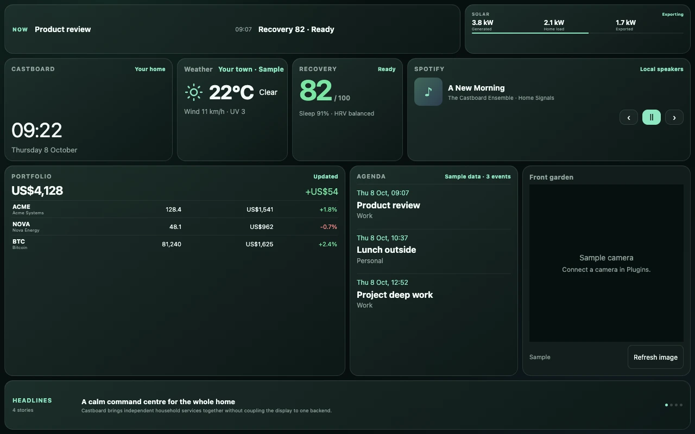
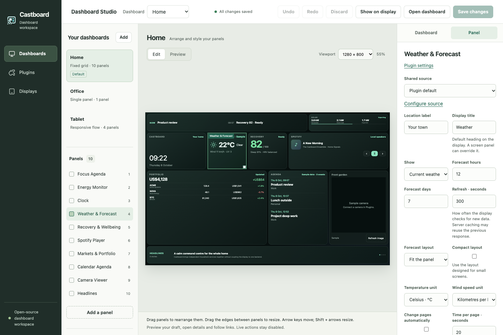
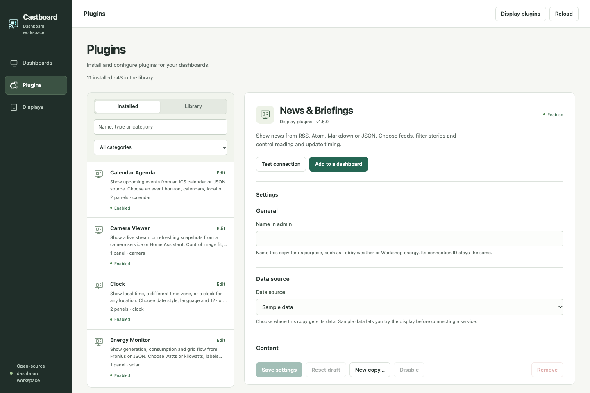
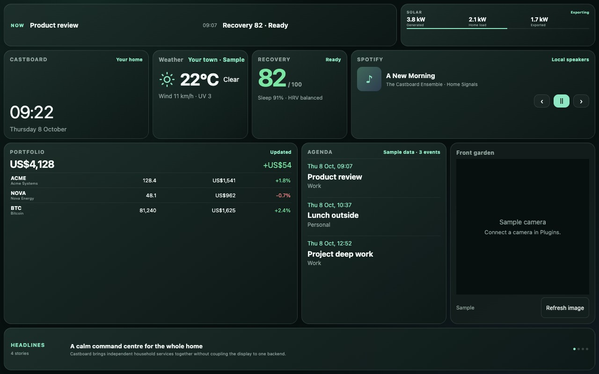
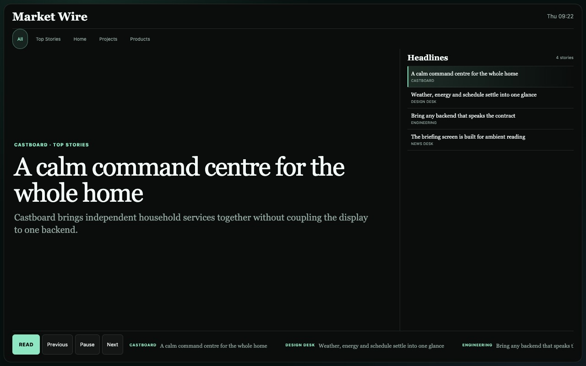

<p align="center">
  
</p>

<h1 align="center">Castboard</h1>

<p align="center">
  <strong>Your screens. Your data. Your layout.</strong><br>
  An open-source dashboard builder for beautiful, plugin-powered smart displays.
</p>

<p align="center">
  <a href="https://github.com/newtonlorenz/castboard/actions/workflows/ci.yml"></a>
  <a href="https://github.com/newtonlorenz/castboard/stargazers"></a>
  
  
  
  
</p>

Castboard turns Google Nest displays, wall tablets, TVs, kiosk browsers, and other web-capable screens into a private ambient dashboard. Design each screen visually, place any plugin anywhere, connect your own backends, and deliver one layout to one display—or many layouts to many displays.

> No hosted account. No vendor-shaped layout. No frontend access to your integration secrets.

<p align="center">
  
</p>

<p align="center">
  
  <br><sub>Design every screen visually, with the real output always in view.</sub>
</p>

## Why Castboard?

Most smart-display dashboards make you choose between a polished but rigid product and an endlessly hand-maintained HTML page. Castboard sits in the useful middle:

| | Castboard |
| --- | --- |
| **Layout** | Visual editor plus reviewable JSON |
| **Screens** | One configuration, one-to-many destinations |
| **Content** | Small, independently failing plugins |
| **Backends** | Demo data, HTTP JSON, files, ICS, LAN services, or your own adapter |
| **Delivery** | Google Cast, direct URL, HTTP webhook, or a custom protocol |
| **Privacy** | Provider credentials and receiver details stay server-side |
| **Runtime** | Node.js, zero production packages, no build step |

## See it in 60 seconds

You need Git and Node.js 20 or newer:

```sh
git clone https://github.com/newtonlorenz/castboard.git
cd castboard
npm run init
npm start
```

`npm run init` never overwrites an existing configuration. The starter works without accounts or API keys: local/demo plugins render immediately, while the default public RSS headlines need internet access.

Now open:

- [`localhost:8787/setup`](http://localhost:8787/setup) — first-run checks and connection tests
- [`localhost:8787/admin`](http://localhost:8787/admin) — visual screen studio
- [`localhost:8787/admin/devices`](http://localhost:8787/admin/devices) — register embedded displays and upload hardware plugins
- [`localhost:8787/admin/plugins`](http://localhost:8787/admin/plugins) — install, configure and test plugins
- [`localhost:8787`](http://localhost:8787) — 10-panel Home dashboard
- [`localhost:8787/screens/office`](http://localhost:8787/screens/office) — full-screen news wire
- [`localhost:8787/screens/tablet`](http://localhost:8787/screens/tablet) — responsive tablet flow

Use Connections at `/setup` to inspect configured plugins, test data connections, view delivery target counts, check optional tools and discover Cast devices. Configuration checks and connection tests are shown separately. The same report is available in a terminal with `npm run doctor`.

In Studio, drag and resize panels, switch screen types, edit plugin options, and tune fonts, colors, spacing, borders, corners, shadows, and per-panel overrides. **Save changes** validates and atomically writes the configuration; open displays pick up the design within five seconds.

## Plugins belong in admin

Prefer to configure it through an AI assistant? The local [Castboard MCP](docs/MCP.md)
exposes configuration, layouts, plugin/provider settings, displays and diagnostics,
with validation before saving and the project guides available directly to AI.
Start Castboard, then connect `node /absolute/path/to/castboard/src/mcp.js` in your
MCP client. See the guide for Codex setup, all tools and credential handling.

Use **Plugins** to browse 35 bundled packages, install independent copies, configure providers and protected credentials, connect sources, test data and see screen usage. Changes apply when you save. Every bundled plugin includes editable settings, display options where relevant, documentation and MIT licence metadata. Library also discovers trusted packages installed locally; it does not download code from a hosted marketplace.

The Ambient collection includes eleven richer displays with independent sources and shared styling. Try its [demo configuration](examples/ambient/castboard.config.json), or see [plugin setup and sharing](docs/PLUGINS.md).



Display hardware is extensible too. In **Displays → Display plugins**, upload a trusted ZIP package, then choose it for a display. Packages can supply device defaults, settings, image conversion, native scene encoding and input translation. A downloadable monochrome example demonstrates 128 × 64 OLED/e-paper pixel conversion. See [display plugin development](docs/display-adapters.md) and [embedded receivers](docs/embedded-displays.md). Firmware still needs a driver for the physical board.

## One canvas, any screen

Every configured screen independently chooses:

- A route and human-readable title.
- A layout type: fixed `grid`, responsive `flow`, immersive `single`, or a custom type.
- Any number of plugin-backed panels with their own geometry, options, and appearance.
- Zero, one, or many targets.
- A default casting protocol, with optional per-target overrides.

```json
{
  "path": "/kitchen",
  "type": "grid",
  "castProtocol": "google-cast",
  "targets": [
    { "name": "Kitchen Hub", "device": "Kitchen Display" },
    { "name": "Wall tablet", "protocol": "url" }
  ],
  "layout": { "columns": 12, "rows": 8, "gap": 8, "padding": 8 },
  "panels": [
    {
      "id": "forecast",
      "plugin": "weather",
      "position": { "column": 1, "row": 1, "width": 4, "height": 2 },
      "appearance": { "fontScale": 110, "accent": "#59d8e6" }
    }
  ]
}
```

News is not a special screen. It is an ordinary plugin that can be a headline strip, a list, or a full-screen editorial wire. The same is true for cameras, calendars, charts, media, and every plugin you add.

<table>
  <tr>
    <td width="50%">
      
      <br><sub><strong>Home:</strong> ten plugins sharing one calm ambient canvas.</sub>
    </td>
    <td width="50%">
      
      <br><sub><strong>Market Wire:</strong> the same news plugin, composed as a full screen.</sub>
    </td>
  </tr>
</table>

## Batteries included, backends optional

The starter configuration demonstrates every first-party visual module:

| Plugin | Built-in provider paths |
| --- | --- |
| Weather | Demo, Open-Meteo, HTTP JSON, file JSON |
| Solar | Demo, Fronius, HTTP JSON, file JSON |
| Recovery | Demo, HTTP JSON, file JSON |
| Spotify | Demo, `spotify_player` CLI, HTTP JSON, file JSON |
| Sonos | Demo, Sonos HTTP bridge, HTTP JSON, file JSON |
| Stocks | Demo, Alpha Vantage free-key watchlist, HTTP JSON, file JSON |
| Calendar | Demo, ICS, HTTP JSON, file JSON |
| Camera | Demo, direct stream, camera discovery service |
| News | Demo, RSS/Atom with public starter feeds, HTTP JSON, file JSON, Markdown directory |
| Clock and focus | Local time plus cross-plugin composition |

Environment placeholders such as `${CALENDAR_ICS_URL}` expand only on the server. Raw plugin settings never appear in `/api/config`.

### Live stocks in five lines

Get a free Alpha Vantage API key, place it in your ignored `.env` or service environment, and choose the symbols you care about:

```json
"stocks": {
  "enabled": true,
  "provider": "alpha-vantage",
  "apiKey": "${ALPHA_VANTAGE_API_KEY}",
  "tickers": ["AAPL", "MSFT", "GOOGL"],
  "refreshMinutes": 240,
  "currency": "USD"
}
```

The free endpoint is suitable for an ambient watchlist, not trading: quotes are generally end-of-day and the provider enforces request limits. Castboard caches the default three-symbol watchlist for four hours so frequent display polls do not consume the daily allowance. For broker holdings, another market source, or computed portfolio values, use the canonical HTTP/file JSON adapter.

### RSS news without an account

The starter aggregates official BBC Top Stories, World, and Business feeds. Replace or extend `plugins.news.feeds` with up to eight RSS or Atom URLs; each entry may set `name` and `category`. Feeds are cached for five minutes by default, and one failed feed does not blank the others. Bloomberg’s official content feeds are commercial, so Castboard does not redistribute or mislabel Bloomberg content—the full-screen `Market Wire` is simply another resizable news panel.

## Plugins are small on purpose

A plugin is a folder with a trusted server-side manifest and, when it appears on a screen, a browser widget:

```text
plugins/air-quality/
  plugin.js   # provider normalization and optional data/action/stream hooks
  widget.js   # mount({ element, config, context, panel })
```

```js
// plugins/air-quality/plugin.js
export function createPlugin({ config }) {
  return {
    id: 'air-quality',
    name: 'Air quality',
    publicConfig: () => ({ title: config.title || 'Air quality' }),
    async getData() {
      return { aqi: 24, status: 'Good' };
    },
  };
}
```

Castboard validates extension IDs and contracts during startup, serves browser widgets and declared public assets, bounds provider payloads, and isolates refresh failures to the affected panel. Read [Writing a plugin](docs/PLUGINS.md) and the [canonical data contracts](docs/PLUGIN-CONTRACTS.md).

## Spotify with local speakers

Spotify is independent of Sonos. Its native provider uses [`spotify_player`](https://github.com/aome510/spotify-player), which can control Spotify Connect or stream through the audio output of the machine running it. A Spotify Premium account and one-time authentication are required.

```sh
# macOS
brew install spotify_player

# Other platforms with Rust installed
cargo install spotify_player --locked

spotify_player authenticate
```

Run `spotify_player` on the Castboard host when you want that machine to appear as a local Spotify speaker, then configure:

```json
"spotify": { "enabled": true, "provider": "spotify-player", "executable": "spotify_player" }
```

Castboard reads `spotify_player get key playback` and sends only allowlisted playback commands. The CLI can control whichever Spotify Connect device is active; local audio comes from `spotify_player` itself, not from the dashboard web page. Linux users who want unattended local playback can install the CLI with its daemon feature and run `spotify_player --daemon`; follow the upstream audio-backend instructions for the host OS.

Sonos remains available separately:

```json
"sonos": { "enabled": true, "provider": "sonos-http", "baseUrl": "${SONOS_BACKEND_URL}" }
```

## Cast it—or just open the URL

Google Cast delivery uses [`catt`](https://github.com/skorokithakis/catt). Install it first with `pipx install catt`, then use `/setup` to discover receiver names. URL and webhook targets require no additional software.

The starter screens deliberately contain no fake receivers. In Connections, discover a device, copy its target JSON into the chosen screen's `targets` array, restart Castboard, and then cast:

```sh
npm run cast -- home
npm run cast -- office --protocol url
npm run cast -- --all
```

Built-in protocols live under `cast-protocols/` and are independent of screen layout. Add a protocol driver for Home Assistant, a kiosk API, another casting system, or hardware that has not been invented yet. See [Casting protocols](docs/CAST-PROTOCOLS.md).

## Docker

```sh
docker compose up --build
```

Compose runs Castboard as an unprivileged user and seeds the demo into a persistent `castboard-data` volume. To use Studio through container or LAN networking, put a token of at least 16 characters in an ignored `.env` file:

```dotenv
CASTBOARD_ADMIN_TOKEN=replace-with-a-long-random-token
```

Then visit [`localhost:8787/admin`](http://localhost:8787/admin) and enter that token. For a separately managed configuration, mount it at `/data/castboard.config.json`.

The base container intentionally does not include `catt`, `spotify_player`, host audio devices, or Spotify credentials. Run those integrations on the host or build a private image that includes them; the demo, URL delivery, webhooks, and HTTP/file providers work in the stock container.

## Architecture at a glance

```text
Smart displays / kiosks / browsers
              │
              ▼ same-origin modules and APIs
┌──────────────────────────────────────────────┐
│ Node core                                    │
│ config · validation · Studio · safe serving │
├──────────────────────────────────────────────┤
│ screen types  │ plugins       │ protocols   │
│ grid/flow/... │ data + widget │ Cast/URL/...│
└──────────────────────────────────────────────┘
              │
              ▼
     Your APIs, files, feeds, and LAN services
```

The design intentionally keeps layout, content, and transport independent. The core does not know what a news desk, Fronius, Spotify, a camera bridge, or your future plugin looks like.

## Security model

Castboard is designed for a trusted home or studio LAN—not direct public-internet exposure.

- Integration URLs, headers, filesystem paths, receiver addresses, and device names remain server-side.
- Studio is loopback-only by default; LAN access requires a bearer token.
- DNS Host validation blocks rebinding attacks.
- Provider responses are timed and size-bounded.
- Custom plugins, screen types, and protocols are trusted executable code. Review them before installation.

Read the complete [security policy](SECURITY.md) before enabling cameras or control plugins.

## Project map

- [Configuration](docs/CONFIGURATION.md)
- [AI configuration with MCP](docs/MCP.md)
- [Visual Studio](docs/ADMIN-STUDIO.md)
- First-run diagnostics: `npm run doctor` or `/setup`
- [Plugin authoring](docs/PLUGINS.md)
- [Plugin data contracts](docs/PLUGIN-CONTRACTS.md)
- [Screen types](docs/SCREEN-TYPES.md)
- [Casting protocols](docs/CAST-PROTOCOLS.md)
- [Architecture and source audit](docs/ARCHITECTURE.md)
- [Migration guide](docs/MIGRATION.md)
- [Publishing checklist](docs/PUBLISHING.md)

## Build with us

```sh
npm test
npm run check
```

Contributions are welcome. Add a plugin, teach Castboard a new screen type or casting protocol, improve receiver compatibility, or share a layout other people can reuse. Start with [CONTRIBUTING.md](CONTRIBUTING.md).

If Castboard gives an old screen a new job, **star the project and show people what you cast**. The best growth loop for a display project is a wall worth copying.

<p align="center">
  <sub>Built for calm screens, local data, and people who would rather own their dashboard.</sub>
</p>

### Bring your own dashboard

Castboard can load external source, view, layout and delivery packages. Multiple configured instances can use one plugin definition, and several views can share one source. Modules own their CSS, schemas, data semantics and actions; the dashboard frame is independent of any particular design.

See [extension contracts and lifecycle](docs/extensions.md) and [the flexible deployment example](examples/flexible/README.md). Private integrations and presets can live outside this repository.

### ESP32 and small displays

Use **Displays** to register a receiver and choose image or native mode. Configure
reusable modals and navigation under **On tap** in Studio. See the
[embedded display guide](docs/embedded-displays.md) for the optional Docker image
renderer, receiver library, protocol and hardware requirements.
