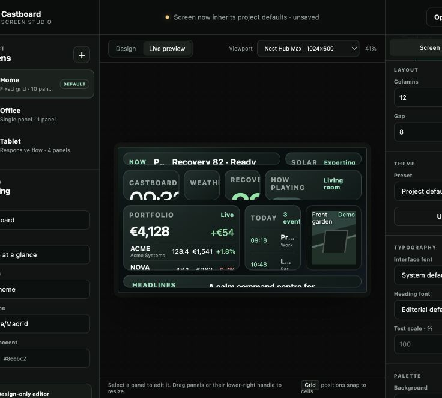

<p align="center">
  
</p>

<h1 align="center">Castboard</h1>

<p align="center">
  <strong>Your screens. Your data. Your layout.</strong><br>
  An open-source control plane for beautiful, plugin-powered smart displays.
</p>

<p align="center">
  
  
  
  
</p>

Castboard turns Google Nest displays, wall tablets, TVs, kiosk browsers, and other web-capable screens into a private ambient dashboard. Design each screen visually, place any plugin anywhere, connect your own backends, and deliver one layout to one display—or many layouts to many displays.

> No hosted account. No vendor-shaped layout. No frontend access to your integration secrets.

<p align="center">
  
  <br><sub>Castboard Studio with a live Nest Hub-sized preview.</sub>
</p>

## Why Castboard?

Most smart-display dashboards make you choose between a polished but rigid product and an endlessly hand-maintained HTML page. Castboard sits in the useful middle:

| | Castboard |
| --- | --- |
| **Layout** | Visual editor plus reviewable JSON |
| **Screens** | One configuration, one-to-many destinations |
| **Content** | Small, independently failing plugins |
| **Backends** | Demo data, HTTP JSON, files, ICS, LAN services, or your own adapter |
| **Delivery** | Google Cast, direct URL, HTTP webhook, or a custom protocol |
| **Privacy** | Provider credentials and receiver details stay server-side |
| **Runtime** | Node.js, zero production packages, no build step |

## See it in 60 seconds

You need Node.js 20 or newer. The included demo is fully functional without accounts, API keys, or internet access.

```sh
cp castboard.config.example.json castboard.config.json
npm start
```

Now open:

- [`localhost:8787/admin`](http://localhost:8787/admin) — visual screen studio
- [`localhost:8787`](http://localhost:8787) — 10-panel Home dashboard
- [`localhost:8787/screens/office`](http://localhost:8787/screens/office) — full-screen news wire
- [`localhost:8787/screens/tablet`](http://localhost:8787/screens/tablet) — responsive tablet flow

In Studio, drag and resize panels, switch screen types, edit plugin options, and tune fonts, colors, spacing, borders, corners, shadows, and per-panel overrides. **Save & apply** validates and atomically writes the configuration; open displays pick up the design within five seconds.

## One canvas, any screen

Every configured screen independently chooses:

- A route and human-readable title.
- A layout type: fixed `grid`, responsive `flow`, immersive `single`, or a custom type.
- Any number of plugin-backed panels with their own geometry, options, and appearance.
- Zero, one, or many targets.
- A default casting protocol, with optional per-target overrides.

```json
{
  "path": "/kitchen",
  "type": "grid",
  "castProtocol": "google-cast",
  "targets": [
    { "name": "Kitchen Hub", "device": "Kitchen Display" },
    { "name": "Wall tablet", "protocol": "url" }
  ],
  "layout": { "columns": 12, "rows": 8, "gap": 8, "padding": 8 },
  "panels": [
    {
      "id": "forecast",
      "plugin": "weather",
      "position": { "column": 1, "row": 1, "width": 4, "height": 2 },
      "appearance": { "fontScale": 110, "accent": "#59d8e6" }
    }
  ]
}
```

News is not a special screen. It is an ordinary plugin that can be a headline strip, a list, or a full-screen editorial wire. The same is true for cameras, calendars, charts, media, and every plugin you add.

## Batteries included, backends optional

The starter configuration demonstrates every first-party visual module:

| Plugin | Built-in provider paths |
| --- | --- |
| Weather | Demo, Open-Meteo, HTTP JSON, file JSON |
| Solar | Demo, Fronius, HTTP JSON, file JSON |
| Recovery | Demo, HTTP JSON, file JSON |
| Spotify / media | Demo, Sonos HTTP, HTTP JSON, file JSON |
| Stocks | Demo, HTTP JSON, file JSON |
| Calendar | Demo, ICS, HTTP JSON, file JSON |
| Camera | Demo, direct stream, camera discovery service |
| News | Demo, HTTP JSON, file JSON, Markdown directory |
| Clock and focus | Local time plus cross-plugin composition |

Environment placeholders such as `${CALENDAR_ICS_URL}` expand only on the server. Raw plugin settings never appear in `/api/config`.

## Plugins are small on purpose

A plugin is a folder with a trusted server-side manifest and, when it appears on a screen, a browser widget:

```text
plugins/air-quality/
  plugin.js   # provider normalization and optional data/action/stream hooks
  widget.js   # mount({ element, config, context, panel })
```

```js
// plugins/air-quality/plugin.js
export function createPlugin({ config }) {
  return {
    id: 'air-quality',
    name: 'Air quality',
    publicConfig: () => ({ title: config.title || 'Air quality' }),
    async getData() {
      return { aqi: 24, status: 'Good' };
    },
  };
}
```

Castboard validates extension IDs and contracts during startup, serves only browser widgets, bounds provider payloads, and isolates refresh failures to the affected panel. Read [Writing a plugin](docs/PLUGINS.md) and the [canonical data contracts](docs/PLUGIN-CONTRACTS.md).

## Cast it—or just open the URL

Google Cast delivery uses [`catt`](https://github.com/skorokithakis/catt). URL and webhook targets require no additional software.

```sh
npm run cast -- home
npm run cast -- office --protocol url
npm run cast -- --all
```

Built-in protocols live under `cast-protocols/` and are independent of screen layout. Add a protocol driver for Home Assistant, a kiosk API, another casting system, or hardware that has not been invented yet. See [Casting protocols](docs/CAST-PROTOCOLS.md).

## Docker

```sh
docker compose up --build
```

Compose runs Castboard as an unprivileged user and seeds the demo into a persistent `castboard-data` volume. To use Studio through container or LAN networking, put a token of at least 16 characters in an ignored `.env` file:

```dotenv
CASTBOARD_ADMIN_TOKEN=replace-with-a-long-random-token
```

Then visit [`localhost:8787/admin`](http://localhost:8787/admin) and enter that token. For a separately managed configuration, mount it at `/data/castboard.config.json`.

## Architecture at a glance

```text
Smart displays / kiosks / browsers
              │
              ▼ same-origin modules and APIs
┌──────────────────────────────────────────────┐
│ Node core                                    │
│ config · validation · Studio · safe serving │
├──────────────────────────────────────────────┤
│ screen types  │ plugins       │ protocols   │
│ grid/flow/... │ data + widget │ Cast/URL/...│
└──────────────────────────────────────────────┘
              │
              ▼
     Your APIs, files, feeds, and LAN services
```

The design intentionally keeps layout, content, and transport independent. The core does not know what Bloomberg, Fronius, Spotify, a camera bridge, or your future plugin looks like.

## Security model

Castboard is designed for a trusted home or studio LAN—not direct public-internet exposure.

- Integration URLs, headers, filesystem paths, receiver addresses, and device names remain server-side.
- Studio is loopback-only by default; LAN access requires a bearer token.
- DNS Host validation blocks rebinding attacks.
- Provider responses are timed and size-bounded.
- Custom plugins, screen types, and protocols are trusted executable code. Review them before installation.

Read the complete [security policy](SECURITY.md) before enabling cameras or control plugins.

## Project map

- [Configuration](docs/CONFIGURATION.md)
- [Visual Studio](docs/ADMIN-STUDIO.md)
- [Plugin authoring](docs/PLUGINS.md)
- [Plugin data contracts](docs/PLUGIN-CONTRACTS.md)
- [Screen types](docs/SCREEN-TYPES.md)
- [Casting protocols](docs/CAST-PROTOCOLS.md)
- [Architecture and source audit](docs/ARCHITECTURE.md)
- [Migration guide](docs/MIGRATION.md)

## Build with us

```sh
npm test
npm run check
```

Contributions are welcome. Add a plugin, teach Castboard a new screen type or casting protocol, improve receiver compatibility, or share a layout other people can reuse. Start with [CONTRIBUTING.md](CONTRIBUTING.md).

If Castboard gives an old screen a new job, **star the project and show people what you cast**. The best growth loop for a display project is a wall worth copying.

<p align="center">
  <sub>Built for calm screens, local data, and people who would rather own their dashboard.</sub>
</p>
